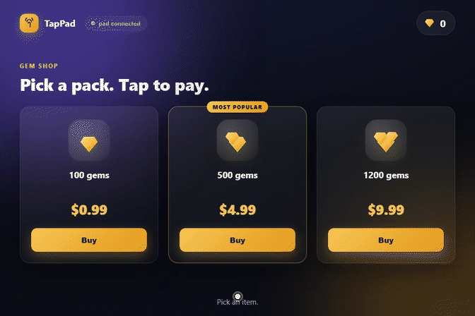
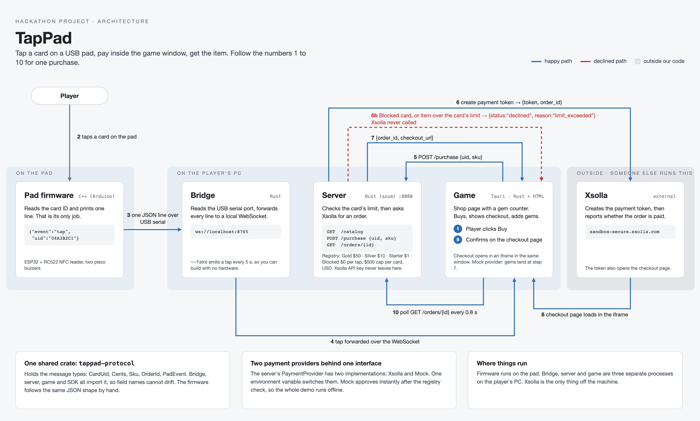

# TapPad

Tap a card on a USB pad, pay inside the game window, get the item.
Tap-to-pay for desktop games, built on Xsolla.

[](https://github.com/xsolla-baku-gametech-hackathon/team-InlandEmpire/actions/workflows/ci.yml)
[](LICENSE)





## Run the demo, no hardware, no Xsolla account

```
make demo                                    # server, fake bridge, then the game if `cargo tauri` exists
scripts\demo.ps1                             # same on Windows without make
```

Or by hand:

```
cargo run -p tappad-server                   # TAPPAD_PROVIDER=mock by default
cargo run -p tappad-bridge -- --fake
cargo tauri dev                              # from crates/tappad-game
```

## Run against the Xsolla sandbox

```
cp .env.example .env                         # fill in project id and API key, TAPPAD_PROVIDER=xsolla
make demo PORT=/dev/cu.usbserial-XXXX        # or scripts\demo.ps1 COM3 on Windows
```

Tap-only, no click, sandbox only: set `TAPPAD_AUTOPAY=true` in `.env` and
install the headless checkout once:

```
pip install playwright && playwright install chromium
```

## Test

```
cargo test --workspace                        # 114 tests, clippy pedantic, no unwrap/expect/panic outside tests
node --test "crates/tappad-game/ui-tests/*.test.mjs"
node --test "sdk/tappad-js/test/*.test.mjs"
```

CI runs all three plus `cargo fmt --check`, `cargo clippy -D warnings` and `cargo audit` on every push.

## How it works

Player clicks Buy. Player taps a card on the pad. The pad prints the card ID
over USB. The bridge forwards it to the game. The game asks the server. The
server checks the card's spending limit and asks Xsolla for an order. The
Xsolla checkout appears inside the game window. The player confirms. The game
polls until the order is paid and grants the gems.

## Layout

| Path | What |
|---|---|
| `crates/tappad-protocol` | Shared message types |
| `crates/tappad-server` | Card registry, Xsolla client, `PaymentProvider` |
| `crates/tappad-bridge` | Serial to WebSocket |
| `crates/tappad-sdk` | Client library for Rust games: taps in, purchases out. For other games; the demo game talks to the server directly |
| `sdk/tappad-js` | The same for browser and Tauri games, plain ES modules. Same scope as the Rust SDK |
| `crates/tappad-game` | Tauri desktop app |
| `firmware/` | Arduino sketch for ESP32 + RC522 |
| `docs/` | Protocol, Xsolla setup, architecture |

## What is real and what is mocked

Real: the pad, the card read, order creation in the Xsolla sandbox, the
sandbox checkout inside the game, order status polling.

Card identity is an allowlist of UIDs in code (`Registry::demo` in
`crates/tappad-server/src/registry.rs`). Each card has a per-tap limit and a
$500 cap for the run (`TAPPAD_CARD_CAP_CENTS`). All prices are USD.

| Card | UID | Per tap |
|---|---|---|
| Gold, the white card with the Xsolla sticker | `8FF14EF1` | $50.00 |
| Silver | `D9916906` | $10.00 |
| Blocked, the white card with the All The Things sticker | `C95DD006` | $0, always declined |
| Gold, fake, from `tappad-bridge --fake` | `04A3B2C1` | $50.00 |
| Starter, fake | `04D4E5F6` | $1.00 |

There is no card enrolment and no lookup anywhere. A phone paying with Apple
Pay is declined because it emits a fresh random UID on every tap, so it can
never match the list; that is the allowlist doing its job, not a rule about
phones. The game shows "Card declined." for both kinds of decline; only the
server log tells `limit_exceeded` from `unknown_card`.

Stand-in: tap-only completion. In production that is Xsolla Tokenization, a
partner feature we do not have. With `TAPPAD_AUTOPAY=true` the server pays each
sandbox order itself through a headless checkout (`scripts/autopay.py`), so a
tap completes with no click in about 27 seconds, 4 of them Xsolla. Without the flag a tap creates
the order and the player confirms with one click on the test card.

The server keeps its state in memory. Order tokens, per-card spend and the
double-tap cache go away on restart, and an order created before a restart is
unknown afterwards: `GET /orders/{id}` answers 404 for it.

The spending limit is checked twice, and neither check is complete on its own.
Before the order is created the server compares its own catalogue price against
the card's limit. The token request sends only a SKU, so Xsolla charges whatever
its catalogue says; when the order is polled the server therefore also refuses
to report it paid if the answer carries an amount above the limit. That amount
field is taken from the Xsolla docs and has not yet been confirmed against a
real response, so on the day the second check may simply never fire. The server
logs a warning at startup when a local price differs from the store's.

With `TAPPAD_AUTOPAY=true` the server launches a headless Chromium through
`scripts/autopay.py` for every sandbox order, at most two at a time, each given
up on after two minutes. It needs Python and Playwright on `PATH`.

## Threat model

The server is built for one laptop or a trusted LAN, and it is not hardened for
anything else. It has no authentication. The card UID is not a secret: anyone
who can read a card, or guess a UID, can post a purchase for it, which is why
the per-tap limit, the per-card cap (`TAPPAD_CARD_CAP_CENTS`, $500 by default)
and the three second double-tap window exist. Only the game's own origins may
call it from a browser, and it refuses to listen on anything but loopback
unless `TAPPAD_ALLOW_REMOTE=1` says otherwise. The Xsolla API key is read once
into a `SecretString`, never logged and never sent to the game; upstream errors
are logged in full but reach the page as a fixed sentence. The bridge prints
card UIDs at `info` so new cards can be read off the log and enrolled.

## Engineering decisions

- Money is integer cents.
- One shared crate for message types so firmware, bridge, server and game
  cannot drift.
- `PaymentProvider` trait: Xsolla in production, mock for offline demo and tests.
- The API key lives only in the server process.
- Firmware is Arduino C++ because the MFRC522 library is mature there and the
  chip only prints JSON lines.

## Roadmap

USB pad today. Xsolla Tokenization for true one tap. Pad built into gaming
lounge seats. Launcher integration.

## Team

| Role | Who |
|---|---|
| Server, Xsolla | Riad Mukhtarov |
| Game, demo laptop | Aykhan Nazaraliyev |
| Protocol, bridge, CI | Shikhi Ibrahimov |
| Hardware | Mubariz Amirli |
| Idea, testing, business | Turan Magsudov |

## Hackathon

Xsolla Baku GameTech Hackathon, build days Sept 10–11. Organiser rules are in
[`docs/hackathon-rules.md`](docs/hackathon-rules.md), conduct in
[`CODE_OF_CONDUCT.md`](CODE_OF_CONDUCT.md).
